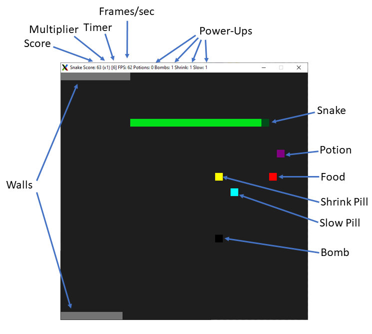

# CPPND: Capstone Snake Game Example

This is a starter repo for the Capstone project in the [Udacity C++ Nanodegree Program](https://www.udacity.com/course/c-plus-plus-nanodegree--nd213). The code for this repo was inspired by [this](https://codereview.stackexchange.com/questions/212296/snake-game-in-c-with-sdl) excellent StackOverflow post and set of responses.

The Capstone Project gives you a chance to integrate what you've learned throughout this program. This project will become an important part of your portfolio to share with current and future colleagues and employers.

In this project, you can build your own C++ application or extend this Snake game, following the principles you have learned throughout this Nanodegree Program. This project will demonstrate that you can independently create applications using a wide range of C++ features.

## Dependencies for Running Locally
* cmake >= 3.7
  * All OSes: [click here for installation instructions](https://cmake.org/install/)
* make >= 4.1 (Linux, Mac), 3.81 (Windows)
  * Linux: make is installed by default on most Linux distros
  * Mac: [install Xcode command line tools to get make](https://developer.apple.com/xcode/features/)
  * Windows: [Click here for installation instructions](http://gnuwin32.sourceforge.net/packages/make.htm)
* SDL2 >= 2.0
  * All installation instructions can be found [here](https://wiki.libsdl.org/Installation)
  * Note that for Linux, an `apt` or `apt-get` installation is preferred to building from source.
* gcc/g++ >= 5.4
  * Linux: gcc / g++ is installed by default on most Linux distros
  * Mac: same deal as make - [install Xcode command line tools](https://developer.apple.com/xcode/features/)
  * Windows: recommend using [MinGW](http://www.mingw.org/)
* pthread 
  * Linux: should be installed by default, cmake file has been updated to include the library
  * Mac: unsure, but possibly add 'clang++ -std=c++11' to build command
  * Windows: unsure, possibly use [pthreads-win32](http://sourceware.org/pthreads-win32/)

## Basic Build Instructions

1. Clone this repo.
2. Make a build directory in the top level directory: `mkdir build && cd build`
3. Compile: `cmake .. && make`
4. Run it: `./SnakeGame`.

---
## Snake: The Sequel
Run your snake around the garden, picking up food as it appears. As you eat, you grow, and you will move faster, but you will also see walls appear to restrict your movement.
Luckily, as you eat more food, there is a chance that power-ups will appear that can help you. Careful, though! The longer you can go without picking up a power-up, the higher
your score multiplier will go. Of course, for the multiplier to increase, you must keep eating food. If you don't eat a new food item before the timer expires, your multiplier 
will reset. It will also reset every time you pick up a power-up.

To help you stay alive, you will find four types of power-ups. You can only use one at a time:

| Power-Up     |     Color      |  Key |  Description  |
| ------------ | -------------- | ---- | ------------- |
| Potions      | purple #800080 | NP 1 | potions grant you a temporary invulnerability - you can literally crawl through walls! |
| Bombs        | black  #000000 | NP 2 | bombs destroy sections of wall, or yourself if you're not careful! |
| Shrink Pills | yellow #FFFF00 | NP 3 | these will shrink you down to almost half your current size, the better to fit through that tight squeeze! |
| Slow Pills   | cyan   #00FFFF | NP 4 | these will make you slow *waaaay* down |

How long can you stay alive and keep eating?

---
## File Structure
The file structure for this project remains largely the same as the starter code, with a few added files in the src directory.

CppND-Capstone-Snake-Game
- build
- cmake
- src
  - color_defines.h - objects of class Color used to define the various objects
  - color.cpp - new class to manage item colors
  - color.h
  - controller.cpp - pre-existing file
  - controller.h
  - game_element.cpp - new class to manage all game elements (walls, food, power-ups)
  - game_element.h
  - game.cpp - pre-existing file
  - game.h
  - main.cpp - pre-existing file
  - renderer.cpp - pre-existing file
  - renderer.h
  - snake.cpp - pre-existing file
  - snake.h
- CMakeLists.txt
- README.md

---
## Class Structure
Along with the pre-existing classes Game, Snake, Renderer, and Controller, new classes have been added. These include Color and GameElement, and GameElement's subclasses Food, Wall, Potion, Bomb, ShrinkPill, and SlowPill.

- Class Game holds an instance of Snake and GameElement::Food on the stack, as well as a vector of shared_ptr's to GameElement that hold all of the walls and power-ups after they are created.
- Class Snake holds a vector of SDL_Point on the stack that represent the body. It also holds two instances of Color for the head and body, and a vector of vectors of shared_ptr's to GameElement which holds the power-ups that the snake has picked up.
- Class Renderer holds pointers to the SDL_Window and SDL_Renderer objects that are used to draw the screen. The signatures for Render and UpdateWindowTitle have been changed slightly from the starting code, and the UpdateWindowTitle function now takes a SnakeData pointer to wrap the multiple new values that are displayed in the title bar.
- Class Controller's structure remains unchanged, but new keys have been added to HandleInput to allow use of the power-ups.
- Class GameElement holds a vector of Color objects for use with certain actions, as well as a std::function reference for callback purposes, a std::thread to run an action, and a std::mutex to protect the color when updating it during the action.
  - There are six sub-classes of GameElement. Most do similar work, with Bomb being the exception. When the action is triggered on a Bomb, the member thread is started and allowed to run to completion. The thread updates the bomb color as it progresses to a final explotion.
- Class Color wraps the four Uint8 values that make up the color that gets passed to the renderer. It overrides operator== to allow for comparison's.

---
# Rubric Points
The following rubric points have been implemented in this project

## README

* [X] A README with instructions is included with the project
  * The README is included with the project and has instructions for building/running the project.
  * If any additional libraries are needed to run the project, these are indicated with cross-platform installation instructions.
  * You can submit your writeup as markdown or pdf.

* [X] The README indicates which project is chosen.
  * The README describes the project you have built.
  * The README also indicates the file and class structure, along with the expected behavior or output of the program.

* [X] The README includes information about each rubric point addressed.
  * The README indicates which rubric points are addressed. The README also indicates where in the code (i.e. files and line numbers) that the rubric points are addressed.

## Compiling and Testing

* [X] The submission must compile and run.
  * The project code must compile and run without errors.
  * We strongly recommend using cmake and make, as provided in the starter repos. If you choose another build system, the code must compile on any reviewer platform.

## Loops, Functions, I/O

* [X] The project demonstrates an understanding of C++ functions and control structures.
  * A variety of control structures are used in the project.
    * switch used in GameElement::GetElementTypeString(ElementType type) - game_element.cpp line 175
    * if/else used in GameElement::UpdateColor() - game_element.cpp line 278
    * while loop used in Bomb::LightFuse() - game_element.cpp line 418
    * iterator while loop in Game::GetNextWall - game_element.cpp line 115
    * for loop used in Renderer::Render - renderer.cpp line 56
  * The project code is clearly organized into functions.
    * GameElement.cpp file structure

* [ ] The project reads data from a file and process the data, or the program writes data to a file.
  * ~~The project reads data from an external file or writes data to a file as part of the necessary operation of the program.~~

* [X] The project accepts user input and processes the input.
  * The project accepts input from a user as part of the necessary operation of the program.
    * Controller::HandleInput takes user input and was expanded to recognize more keys than originally provided - controller.cpp line 13

## Object Oriented Programming

* [X] The project uses Object Oriented Programming techniques.
  * The project code is organized into classes with class attributes to hold the data, and class methods to perform tasks.
    * game_element.h/cpp, color.h/cpp

* [X] Classes use appropriate access specifiers for class members.
  * All class data members are explicitly specified as public, protected, or private.
    * color.h lines 5 & 28
    * game_element.h lines 21 & 100

* [X] Class constructors utilize member initialization lists.
  * All class members that are set to argument values are initialized through member initialization lists.
    * game_element.cpp lines 6 through 120
    * color.cpp lines 3 through 9

* [X] Classes abstract implementation details from their interfaces.
  * All class member functions document their effects, either through function names, comments, or formal documentation. Member functions do not change program state in undocumented ways.

* [X] Classes encapsulate behavior.
  * Appropriate data and functions are grouped into classes. Member data that is subject to an invariant is hidden from the user. State is accessed via member functions.
    * game_element.h keeps state protected so the subclasses can use but no one outside of the class can use it without using an accessor
      * _elementType on line 109
      * _available on line 112
    * color.h locks its members under private access so that all others must use accessor functions
      * private data members on lines 29 - 32
      * accessor functions declared starting on line 12

* [X] Classes follow an appropriate inheritance hierarchy.
  * Inheritance hierarchies are logical. Composition is used instead of inheritance when appropriate. Abstract classes are composed of pure virtual functions. Override functions are specified.
    * game_element.h contains definitions for GameElement and its six subclasses; Food, Wall, Potion, Bomb, ShrinkPill, and SlowPill
    * game_element.h contains a pure virtual function and a regular virtual function that the subclasses override.
      * UseItem() pure virtual defined on line 98
      * LoadActionColors() virtual defined on line 118
      * the above are overriden in subclasses as needed - lines 131, 143, 156, 170-171, 184, & 197
    * class Food 'is-a' GameElement - game_element.h line 122
    * class Snake 'has-a' Color - snake.h line 84

* [X] Overloaded functions allow the same function to operate on different parameters.
  * function is overloaded with different signatures for the same function name.
    * game_element.h - constructor was overloaded multiple times - lines 44 - 47

* [X] Derived class functions override virtual base class functions.
  * One member function in an inherited class overrides a virtual base class member function.
    * game_element.h contains a couple of pure virtual functions and a regular virtual function that the subclasses override.
      * UseItem() pure virtual defined on line 98

* [ ] Templates generalize functions in the project.
  * ~~One function is declared with a template that allows it to accept a generic parameter.~~

## Memory Management

* [X] The project makes use of references in function declarations.
  * At least two variables are defined as references, or two functions use pass-by-reference in the project code.
    * renderer.cpp - Renderer::Render was updated to take a reference to the Snake object - line 46
    * snake.h - add element functions all take a reference to the element object - lines 43 - 46

* [X] The project uses destructors appropriately.
  * At least one class that uses unmanaged dynamically allocated memory, along with any class that otherwise needs to modify state upon the termination of an object, uses a destructor.
    * snake.cpp - managed a pointer to a SnakeData struct created on the heap - destructor properly deletes - lines 16 - 22

* [X] The project uses scope / Resource Acquisition Is Initialization (RAII) where appropriate.
  * The project follows the Resource Acquisition Is Initialization pattern where appropriate, by allocating objects at compile-time, initializing objects when they are declared, and utilizing scope to ensure their automatic destruction.

* [] The project follows the Rule of 5.
  * ~~For all classes, if any one of the copy constructor, copy assignment operator, move constructor, move assignment operator, and destructor are defined, then all of these functions are defined.~~

* [ ] The project uses move semantics to move data, instead of copying it, where possible.
  * ~~For classes with move constructors, the project returns objects of that class by value, and relies on the move constructor, instead of copying the object.~~

* [X] The project uses smart pointers instead of raw pointers.
  * The project uses at least one smart pointer: unique_ptr, shared_ptr, or weak_ptr. The project does not use raw pointers.
    * shared_ptr's are used in game.h/cpp and snake.h/cpp to manage the GameElement's that get passed back and forth.
      * snake.h - line 97
      * game.h - line 37

## Concurrency

* [X] The project uses multithreading.
  * The project uses multiple threads in the execution.
    * The Bomb class uses threads when a bomb is placed - game_element.cpp - line 415

* [ ] A promise and future is used in the project.
  * ~~A promise and future is used to pass data from a worker thread to a parent thread in the project code.~~

* [X] A mutex or lock is used in the project.
  * A mutex or lock (e.g. std::lock_guard or `std::unique_lock) is used to protect data that is shared across multiple threads in the project code.
    * a mutex and unique_lock is used to manage access to the _currentColor variable in each GameElement, since multiple threads may be trying to access/write it at the same time - e.g. game_element.cpp - line 283

* [ ] A condition variable is used in the project.
  * ~~A std::condition_variable is used in the project code to synchronize thread execution.~~

